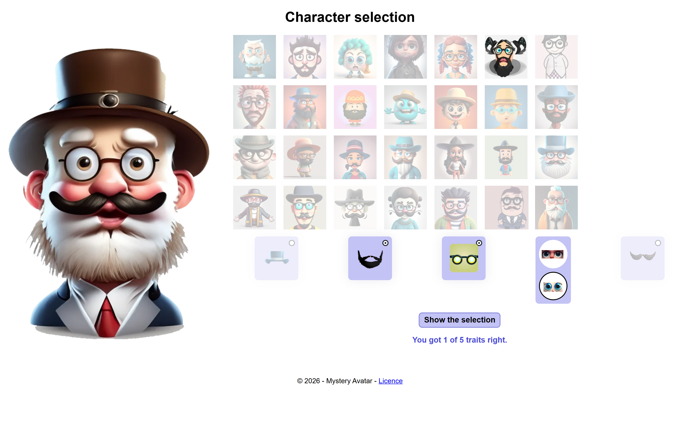
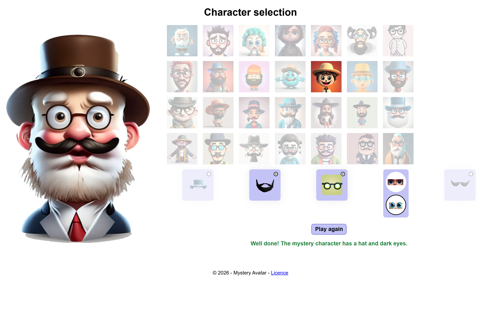
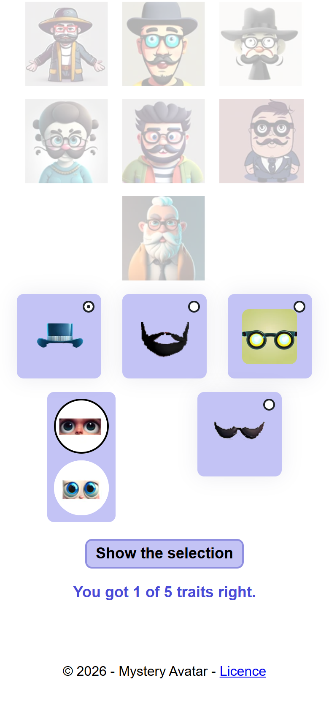

# mystery-avatar

Twenty-eight characters, one picked in secret. Tick up to two features and
an eye colour, show the selection to see which characters match and how
many of the five traits you got right, then click the one you think it is.
Guess Who?, in one page of plain JavaScript.

HTML, CSS and JavaScript, no framework, no build step, no dependency.

## Screenshots








## How it works

**The characters are read from their pictures.** Each file in
`images/characters/` is named after the traits of the character it shows,
`hat_glasses_blueeyes_beard.webp` for instance. `characterFromPicture()`
turns a file name into an object with `hat`, `beard`, `glasses`,
`moustache` and `blueEyes`, so the data and the pictures cannot drift
apart. The grid is built at load with `createElement`, one button holding
one picture per character, so a character can be clicked or reached with
the keyboard.

**Two features at most.** Each box's `change` event runs `limitFeatures()`:
once two boxes are ticked the other two are disabled, and unticking one
frees them again. The eye colour is a pair of radios, so it always has a
value.

**Show the selection.** The form's `submit` reads the five controls into an
object shaped like a character, fades every character that does not match
all five, and counts how many of the five traits the selection shares with
the mystery character: that number is the hint under the button.

**Guessing.** One `click` listener on the list, not one per character: a
wrong one says so and the game goes on; the right one stays clear while
the others fade, and Play again picks a new mystery and resets everything.

**Nothing moves at load.** The grid is filled after the first paint, so its
height is reserved in CSS for each width, which keeps the layout shift at
zero while the pictures arrive.

**Every element is looked up once, and every function has a name.** The
handful of elements the game touches are found at the top of the script;
no anonymous or arrow function anywhere.

## Running it

Open `index.html` in a browser, or serve the folder:

```bash
python -m http.server 8000
```

## Résumé

Vingt-huit personnages, un tiré au sort. On coche deux caractéristiques au
plus (chapeau, barbe, lunettes, moustache) et une couleur d'yeux (noirs ou
bleus), on affiche la sélection : les personnages qui correspondent
restent nets, les autres s'estompent, et une ligne dit combien des cinq
traits du personnage mystère sont trouvés. Un clic sur un personnage est
une tentative ; le bon reste net, les autres s'estompent, et une partie neuve peut
commencer.
HTML, CSS et JavaScript natif, fonctions nommées uniquement ; chaque
personnage est lu depuis le nom de son image.

## Licence

MIT. See [LICENSE](LICENSE).
